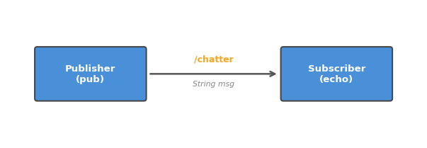

# 001. ROS 2 동작 환경 확인하기

devcontainer를 열고 ROS 2가 정상적으로 설치되어 동작하는지 확인한다.

## ROS 2란?

ROS 2(Robot Operating System 2)는 로봇 소프트웨어를 만들기 위한 **미들웨어 프레임워크**다.
운영체제가 아니라, 로봇의 여러 기능(센서, 모터, 카메라 등)을 **독립적인 프로그램(노드)**으로 나누고
이들이 서로 **메시지를 주고받으며 협력**하도록 해주는 통신 구조를 제공한다.

핵심 개념을 간단히 정리하면:

- **노드(Node)**: 하나의 기능을 담당하는 독립 프로세스. 예: 카메라 노드, 모터 노드
- **토픽(Topic)**: 노드 간 메시지를 주고받는 채널. 발행자(Publisher)가 보내고, 구독자(Subscriber)가 받는다
- **메시지(Message)**: 토픽을 통해 전달되는 데이터 구조. 문자열, 숫자, 좌표 등 다양한 타입이 있다

이 튜토리얼에서는 환경이 제대로 갖춰졌는지 확인하면서, 위 개념을 직접 체험한다.

## ROS Distro란?

ROS 2는 버전을 **Distro(배포판)** 단위로 관리한다.
Ubuntu 버전에 맞춰 지원되며, 이 환경에서는 Ubuntu 22.04에 대응하는 **Humble Hawksbill**을 사용한다.

| Distro | Ubuntu | 지원 기간 |
|--------|--------|-----------|
| Humble | 22.04 | 2022–2027 (LTS) |
| Iron | 22.04 | 2023–2024 |
| Jazzy | 24.04 | 2024–2029 (LTS) |

LTS(Long Term Support) 버전인 Humble을 사용하는 이유는 안정성과 호환 패키지가 가장 많기 때문이다.

## 사전 조건

- VS Code에서 `Reopen in Container` 실행 완료

## 1. 환경변수 확인

```bash
echo $ROS_DISTRO
```

`humble`이 출력되면 정상.

`ROS_DISTRO`는 현재 활성화된 ROS 2 배포판 이름을 담고 있는 환경변수다.
이 값이 설정되어 있다는 것은 `source /opt/ros/humble/setup.bash`가 실행되어
ROS 2의 명령어와 라이브러리를 사용할 준비가 된 상태라는 뜻이다.

## 2. ROS 2 CLI 확인

```bash
ros2 doctor --report | head -10
```

네트워크 정보가 출력되면 ros2 명령어가 정상 동작하는 것이다.

`ros2`는 ROS 2의 통합 CLI 도구다. 노드 실행, 토픽 확인, 서비스 호출 등 거의 모든 작업을
이 하나의 명령어로 수행한다. `ros2 doctor`는 현재 시스템의 ROS 2 상태를 진단해준다.

## 3. 토픽 리스트 확인

```bash
ros2 topic list
```

아래 두 토픽이 보이면 ROS 2 데몬이 정상 기동된 것이다:

```
/parameter_events
/rosout
```

이 두 토픽은 ROS 2가 기본적으로 제공하는 **시스템 토픽**이다:

- `/rosout` — 모든 노드의 로그 메시지가 이 토픽으로 모인다. 디버깅할 때 유용하다.
- `/parameter_events` — 노드의 파라미터(설정값)가 변경될 때 알림이 발행되는 토픽이다.

아직 아무 노드도 실행하지 않았기 때문에 이 두 개만 보이는 것이 정상이다.

## 4. Pub/Sub 테스트

ROS 2의 핵심 통신 방식인 토픽 발행(publish)과 구독(subscribe)을 직접 테스트한다.



Publisher가 `/chatter`라는 토픽에 문자열을 보내면, Subscriber가 그 토픽을 구독해서 받아보는 구조다.
둘은 서로의 존재를 직접 알 필요가 없다 — **토픽 이름**만 같으면 자동으로 연결된다.
이것이 ROS 2 통신의 핵심 특징인 **느슨한 결합(loose coupling)**이다.

### 4-1. 터미널 1: 구독자 실행

```bash
ros2 topic echo /chatter std_msgs/msg/String
```

실행하면 메시지를 기다리며 대기한다.

`echo`는 해당 토픽에 도착하는 메시지를 터미널에 출력해주는 명령이다.
`std_msgs/msg/String`은 메시지 타입을 지정한 것으로, ROS 2 표준 문자열 메시지다.

### 4-2. 터미널 2: 발행자 실행

새 터미널을 열고:

```bash
ros2 topic pub /chatter std_msgs/msg/String "data: 'hello ros2'" --once
```

`pub`은 토픽에 메시지를 발행하는 명령이다. `--once` 옵션은 한 번만 보내고 종료한다는 뜻이다.
이 옵션이 없으면 1초에 한 번씩 계속 보낸다.

### 4-3. 결과 확인

터미널 1에 아래와 같이 출력되면 성공:

```
data: hello ros2
---
```

서로 다른 터미널(프로세스)에서 실행한 두 명령이, 토픽을 통해 메시지를 주고받은 것이다.
실제 로봇에서도 동일한 구조로 센서 데이터를 전달하고, 모터를 제어한다.

## 정리

| 명령어 | 역할 |
|--------|------|
| `ros2 topic list` | 현재 활성화된 토픽 목록 확인 |
| `ros2 topic pub` | 토픽에 메시지 발행 |
| `ros2 topic echo` | 토픽의 메시지 구독/출력 |
| `ros2 doctor` | ROS 2 시스템 상태 진단 |

**이 튜토리얼에서 배운 것:**
ROS 2는 독립 프로세스(노드)가 토픽을 통해 메시지를 주고받는 구조이며,
`ros2` CLI로 토픽을 직접 발행하고 구독할 수 있다.
다음 튜토리얼에서는 Turtlesim을 통해 이 구조가 실제로 어떻게 동작하는지 눈으로 확인한다.
