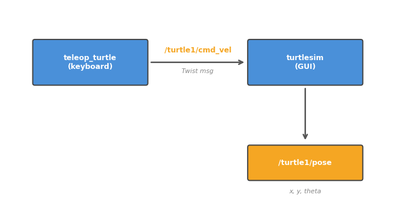

# 002. Turtlesim으로 ROS 2 체험하기

Turtlesim은 ROS 2 공식 학습용 시뮬레이터다. 화면에 거북이를 띄우고 토픽을 통해 조종하면서
ROS 2의 동작 원리를 직관적으로 이해할 수 있다.

## 왜 Turtlesim인가?

실제 로봇을 다루기 전에 ROS 2의 통신 구조를 눈으로 보며 익히기 위한 도구다.
Turtlesim의 거북이는 실제 로봇과 동일한 방식으로 동작한다:

- **속도 명령**을 토픽으로 받아서 움직인다 (실제 로봇의 모터 제어와 같은 구조)
- **현재 위치**를 토픽으로 발행한다 (실제 로봇의 센서 피드백과 같은 구조)
- 별도의 노드가 키보드 입력을 받아 속도 명령을 발행한다 (실제 로봇의 조종기와 같은 구조)



## 노드(Node)란?

001에서 토픽을 통한 메시지 전달을 해봤다. 이제 **노드**를 이해할 차례다.

노드는 ROS 2에서 **하나의 기능을 수행하는 독립 프로세스**다.
하나의 프로그램이 모든 것을 처리하는 대신, 기능별로 노드를 나누고 토픽으로 연결한다.

Turtlesim에서 실행되는 노드:

| 노드 이름 | 역할 |
|-----------|------|
| `turtlesim` | 거북이를 화면에 그리고, 속도 명령을 받아 움직인다 |
| `teleop_turtle` | 키보드 입력을 받아 속도 메시지로 변환한다 |

두 노드는 서로 직접 호출하지 않는다. `/turtle1/cmd_vel`이라는 **토픽**을 매개로 연결될 뿐이다.
이 구조 덕분에 teleop 노드를 다른 조종 방식(조이스틱, 자율주행 등)으로 바꿔도
turtlesim 쪽은 코드를 전혀 수정할 필요가 없다.

## 사전 조건

- devcontainer 실행 중
- 브라우저에서 http://localhost:6080 접속 → 비밀번호 `vscode` 입력 → Connect

## 1. Turtlesim 노드 실행

```bash
ros2 run turtlesim turtlesim_node
```

브라우저(noVNC)에 파란 배경과 거북이가 보이면 성공.

`ros2 run` 명령의 구조:

```
ros2 run <패키지 이름> <실행파일 이름>
```

- `turtlesim` — 패키지 이름. ROS 2에서 코드는 **패키지** 단위로 배포된다.
- `turtlesim_node` — 해당 패키지 안의 실행파일 이름.

하나의 패키지에 여러 실행파일이 들어갈 수 있다.
실제로 `turtlesim` 패키지에는 `turtlesim_node`와 `turtle_teleop_key` 두 개가 있다.

## 2. 키보드로 거북이 조종

새 터미널을 열고:

```bash
ros2 run turtlesim turtle_teleop_key
```

이 터미널에 포커스를 두고 방향키를 누르면 거북이가 움직인다.

| 키 | 동작 |
|----|------|
| ↑ | 전진 |
| ↓ | 후진 |
| ← | 좌회전 |
| → | 우회전 |

내부적으로 일어나는 일: 방향키를 누를 때마다 `turtle_teleop_key` 노드가
`/turtle1/cmd_vel` 토픽에 `geometry_msgs/msg/Twist` 메시지를 발행한다.
`turtlesim_node`가 이 토픽을 구독하고 있어서, 메시지가 도착할 때마다 거북이를 움직인다.

## 3. 토픽 관찰하기

거북이를 움직이는 동안 어떤 메시지가 오가는지 확인해 보자.

### 3-1. 활성 토픽 목록

새 터미널에서:

```bash
ros2 topic list
```

`/turtle1/cmd_vel`, `/turtle1/pose` 등이 보인다.

주요 토픽의 의미:

| 토픽 | 방향 | 설명 |
|------|------|------|
| `/turtle1/cmd_vel` | teleop → turtlesim | 속도/회전 명령 |
| `/turtle1/pose` | turtlesim → 외부 | 거북이의 현재 위치와 방향 |
| `/turtle1/color_sensor` | turtlesim → 외부 | 거북이 발밑의 배경 색상 |

### 3-2. 속도 명령 토픽 관찰

```bash
ros2 topic echo /turtle1/cmd_vel
```

teleop에서 방향키를 누르면 이 터미널에 `linear`, `angular` 값이 출력된다.
키보드 입력이 토픽 메시지로 변환되어 turtlesim에 전달되는 것이다.

**Twist 메시지 구조:**

```
linear:    # 직선 속도 (m/s)
  x: 2.0  # 전진/후진 (양수=전진)
  y: 0.0
  z: 0.0
angular:   # 회전 속도 (rad/s)
  x: 0.0
  y: 0.0
  z: 1.8  # 좌/우 회전 (양수=반시계)
```

`Twist`는 로봇 제어에서 가장 많이 쓰이는 메시지 타입 중 하나다.
3차원 직선 속도(`linear`)와 3차원 회전 속도(`angular`)를 담는다.
거북이는 2D이므로 `linear.x`(전후)와 `angular.z`(회전)만 사용한다.

### 3-3. 거북이 위치 확인

```bash
ros2 topic echo /turtle1/pose
```

거북이의 현재 좌표(x, y)와 방향(theta)이 실시간으로 출력된다.

```
x: 5.54          # X 좌표 (0~11.09)
y: 5.54          # Y 좌표 (0~11.09)
theta: 0.0       # 방향 (라디안)
linear_velocity: 0.0
angular_velocity: 0.0
```

이 데이터는 turtlesim 노드가 **지속적으로 발행**하는 것이다.
실제 로봇에서는 IMU, 엔코더 등의 센서 노드가 이런 식으로 위치/자세 정보를 발행한다.

## 4. 명령어로 직접 거북이 움직이기

teleop 없이 직접 토픽을 발행해서 거북이를 움직일 수 있다:

```bash
ros2 topic pub --once /turtle1/cmd_vel geometry_msgs/msg/Twist \
  "{linear: {x: 2.0, y: 0.0, z: 0.0}, angular: {x: 0.0, y: 0.0, z: 1.8}}"
```

거북이가 앞으로 가면서 좌회전한다.

이 명령은 001에서 배운 `ros2 topic pub`과 동일한 구조다.
teleop 노드가 하는 일을 CLI에서 직접 한 것이다. 즉, **토픽 발행은 어디서든 가능**하며
turtlesim 입장에서는 메시지가 teleop에서 온 것인지, CLI에서 온 것인지 구분하지 않는다.

직접 값을 바꿔가며 실험해보자:

```bash
# 제자리 회전 (전진 없이 회전만)
ros2 topic pub --once /turtle1/cmd_vel geometry_msgs/msg/Twist \
  "{linear: {x: 0.0}, angular: {z: 3.0}}"

# 직선 전진 (회전 없이 직진만)
ros2 topic pub --once /turtle1/cmd_vel geometry_msgs/msg/Twist \
  "{linear: {x: 3.0}, angular: {z: 0.0}}"
```

## 5. 토픽 정보 확인하기

토픽의 메시지 타입이 무엇인지 확인하는 방법:

```bash
ros2 topic info /turtle1/cmd_vel
```

```
Type: geometry_msgs/msg/Twist
Publisher count: 1
Subscription count: 1
```

메시지 타입의 내부 구조를 보려면:

```bash
ros2 interface show geometry_msgs/msg/Twist
```

이렇게 토픽의 타입을 확인하고 → 구조를 파악하고 → 직접 발행하는 흐름은
새로운 로봇을 처음 다룰 때도 동일하게 사용하는 패턴이다.

## 6. 노드와 토픽 관계 시각화

```bash
ros2 run rqt_graph rqt_graph
```

noVNC 화면에 노드 간 연결 그래프가 표시된다.
`teleop_turtle` → `/turtle1/cmd_vel` → `turtlesim` 흐름을 확인할 수 있다.

rqt_graph는 현재 실행 중인 노드와 토픽의 연결 관계를 시각적으로 보여주는 도구다.
시스템이 복잡해질수록 이 도구의 가치가 커진다 — 어떤 노드가 어떤 토픽을 발행/구독하는지
한눈에 파악할 수 있기 때문이다.

## 정리

| 명령어 | 역할 |
|--------|------|
| `ros2 run <패키지> <노드>` | 노드 실행 |
| `ros2 topic list` | 활성 토픽 목록 |
| `ros2 topic echo <토픽>` | 토픽 메시지 실시간 확인 |
| `ros2 topic pub <토픽> <타입> <값>` | 토픽에 메시지 직접 발행 |
| `ros2 topic info <토픽>` | 토픽의 타입과 연결 정보 확인 |
| `ros2 interface show <타입>` | 메시지 타입의 내부 구조 확인 |
| `rqt_graph` | 노드-토픽 연결 관계 시각화 |

**이 튜토리얼에서 배운 것:**

- **노드**는 하나의 기능을 담당하는 독립 프로세스다
- 노드끼리는 **토픽**을 통해 메시지를 주고받으며, 서로 직접 의존하지 않는다
- `Twist` 메시지는 로봇에 속도 명령을 보내는 표준 메시지 타입이다
- 토픽 정보 확인 → 구조 파악 → 직접 발행의 패턴은 어떤 로봇에서도 동일하다

다음 튜토리얼에서는 노드를 더 깊이 파고들어, 여러 노드를 동시에 관리하는 방법을 배운다.
