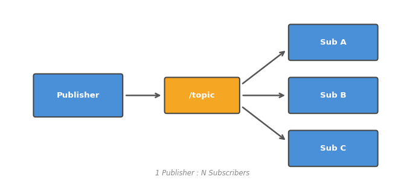

# 004. 토픽 깊이 파보기

002에서 토픽의 기본을 체험했다. 이 튜토리얼에서는 토픽의 **통신 모델**을 이해하고,
QoS, 다중 구독, Hz 측정 등 실무에서 필요한 기법을 배운다.

## 토픽 통신 모델

토픽은 **발행-구독(Pub/Sub)** 패턴을 사용한다. 핵심 특징:

- **비동기**: Publisher는 보내고 끝. Subscriber가 받았는지 확인하지 않는다
- **1:N / N:1**: 하나의 토픽에 여러 Publisher, 여러 Subscriber가 붙을 수 있다
- **느슨한 결합**: Publisher와 Subscriber는 서로의 존재를 몰라도 된다



이 구조는 **센서 데이터 스트리밍**에 적합하다. 카메라가 초당 30장의 이미지를 발행하면,
인식 노드, 녹화 노드, 시각화 노드가 각각 독립적으로 구독한다.

## 사전 조건

- turtlesim 노드와 teleop 노드가 실행 중

## 1. 토픽 목록과 타입

```bash
ros2 topic list -t
```

`-t` 옵션은 각 토픽의 **메시지 타입**까지 함께 표시한다:

```
/turtle1/cmd_vel [geometry_msgs/msg/Twist]
/turtle1/pose [turtlesim/msg/Pose]
/turtle1/color_sensor [turtlesim/msg/Color]
```

메시지 타입은 `패키지/msg/이름` 형식이다.
같은 타입의 메시지를 쓰는 토픽끼리는 데이터 구조가 동일하다.

## 2. 토픽 발행 속도 측정

```bash
ros2 topic hz /turtle1/pose
```

```
average rate: 62.50
	min: 0.015s max: 0.017s std dev: 0.00050s
```

turtlesim은 약 62.5Hz(초당 62.5회)로 위치를 발행한다.
이 정보는 시스템 성능을 점검하거나, 센서 데이터 누락을 확인할 때 유용하다.

`Ctrl+C`로 종료한다.

## 3. 토픽 대역폭 측정

```bash
ros2 topic bw /turtle1/pose
```

초당 전송되는 데이터량(bytes/sec)을 확인한다.
카메라 토픽처럼 대용량 데이터를 다룰 때 네트워크 부하를 가늠하는 데 쓴다.

## 4. 다중 구독자 테스트

토픽은 **여러 구독자가 동시에 받을 수 있다**. 이를 직접 확인해보자.

터미널 A:

```bash
ros2 topic echo /turtle1/pose
```

터미널 B:

```bash
ros2 topic echo /turtle1/pose
```

두 터미널 모두 동일한 데이터가 출력된다.
Publisher는 한 번만 보내지만, 모든 Subscriber가 각각 받는다.
이것이 1:N 통신이다.

## 5. 다중 발행자 테스트

반대로 **여러 Publisher가 같은 토픽에 보내는 것**도 가능하다:

```bash
ros2 topic pub /turtle1/cmd_vel geometry_msgs/msg/Twist \
  "{linear: {x: 1.0}, angular: {z: 0.5}}" --rate 1
```

teleop과 이 명령 모두 `/turtle1/cmd_vel`에 발행하게 된다.
turtlesim은 마지막에 도착한 메시지를 기준으로 움직인다.

## 6. QoS (Quality of Service) 확인

```bash
ros2 topic info /turtle1/cmd_vel --verbose
```

QoS 프로파일이 출력된다:

```
Reliability: RELIABLE
Durability: VOLATILE
History: KEEP_LAST (depth: 10)
```

**QoS**는 메시지 전달 품질을 제어하는 설정이다:

| 항목 | 의미 |
|------|------|
| Reliability | `RELIABLE`=재전송 보장, `BEST_EFFORT`=손실 허용 |
| Durability | `VOLATILE`=구독 시점 이후만, `TRANSIENT_LOCAL`=과거 메시지도 전달 |
| History | 큐에 보관할 메시지 수 |

센서 데이터는 최신값만 중요하므로 `BEST_EFFORT` + `VOLATILE`을 쓰고,
설정이나 명령은 손실이 없어야 하므로 `RELIABLE`을 쓴다.

Publisher와 Subscriber의 QoS가 **호환되지 않으면 통신이 안 된다**는 점이 중요하다.

## 정리

| 명령어 | 역할 |
|--------|------|
| `ros2 topic list -t` | 토픽 목록 + 메시지 타입 |
| `ros2 topic hz <토픽>` | 발행 주기(Hz) 측정 |
| `ros2 topic bw <토픽>` | 대역폭 측정 |
| `ros2 topic info <토픽> --verbose` | QoS 포함 상세 정보 |

**이 튜토리얼에서 배운 것:**

- 토픽은 비동기 1:N, N:1 통신을 지원하는 Pub/Sub 채널이다
- `hz`와 `bw`로 토픽의 주기와 대역폭을 측정할 수 있다
- QoS 설정이 Publisher/Subscriber 간에 호환되어야 통신이 된다

다음 튜토리얼에서는 토픽과 다른 통신 방식인 **서비스**를 배운다.
