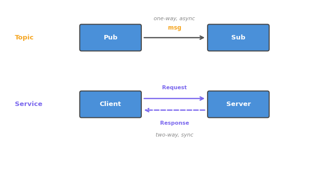

# 005. 서비스 이해하기

토픽은 "일방적으로 보내는" 통신이다. 반면 **서비스(Service)**는 "요청하고 응답을 받는" 통신이다.
이 튜토리얼에서는 서비스의 개념과 CLI 사용법을 배운다.

## 토픽 vs 서비스

| 구분 | 토픽 (Topic) | 서비스 (Service) |
|------|-------------|-----------------|
| 패턴 | 발행-구독 (Pub/Sub) | 요청-응답 (Request/Reply) |
| 방향 | 단방향 | 양방향 |
| 동기성 | 비동기 | 동기 (응답을 기다림) |
| 용도 | 센서 데이터 스트리밍 | 일회성 작업 요청 |
| 연결 | 1:N, N:1 | 1:1 (한 번에 하나의 요청) |



토픽은 센서 데이터처럼 **지속적으로 흐르는 데이터**에 적합하다.
서비스는 "거북이를 특정 위치로 이동시켜줘"처럼 **한 번 요청하고 결과를 받는 작업**에 적합하다.

## 서비스의 구조

서비스는 **서버(Server)**와 **클라이언트(Client)**로 구성된다:

1. **Client**가 요청(Request)을 보낸다
2. **Server**가 요청을 처리한다
3. **Server**가 응답(Response)을 돌려준다
4. **Client**가 응답을 받고 다음 작업을 진행한다

Client는 응답이 올 때까지 **대기**한다. 이것이 토픽과의 가장 큰 차이다.

## 사전 조건

- turtlesim 노드 실행 중

## 1. 서비스 목록 확인

```bash
ros2 service list
```

```
/clear
/kill
/reset
/spawn
/turtle1/set_pen
/turtle1/teleport_absolute
/turtle1/teleport_relative
...
```

turtlesim이 제공하는 서비스들이 보인다. 각각의 역할:

| 서비스 | 역할 |
|--------|------|
| `/clear` | 거북이 궤적 지우기 |
| `/reset` | 시뮬레이터 초기화 |
| `/spawn` | 새 거북이 생성 |
| `/kill` | 거북이 삭제 |
| `/turtle1/set_pen` | 펜 색상/두께 변경 |
| `/turtle1/teleport_absolute` | 절대 좌표로 순간이동 |
| `/turtle1/teleport_relative` | 상대 거리만큼 순간이동 |

## 2. 서비스 타입 확인

```bash
ros2 service type /turtle1/teleport_absolute
```

```
turtlesim/srv/TeleportAbsolute
```

서비스 타입은 `패키지/srv/이름` 형식이다. 토픽의 `msg`와 구분된다.

## 3. 서비스 인터페이스 확인

```bash
ros2 interface show turtlesim/srv/TeleportAbsolute
```

```
float32 x
float32 y
float32 theta
---
```

`---` 위가 **Request**(요청), 아래가 **Response**(응답)이다.
이 서비스는 x, y, theta를 받아서 거북이를 이동시키고, 응답은 비어 있다(성공/실패만 알림).

다른 서비스도 확인해보자:

```bash
ros2 interface show turtlesim/srv/Spawn
```

```
float32 x
float32 y
float32 theta
string name
---
string name
```

`/spawn`은 위치와 이름을 받아 새 거북이를 만들고, 생성된 거북이 이름을 돌려준다.

## 4. 서비스 호출하기

### 4-1. 거북이 순간이동

```bash
ros2 service call /turtle1/teleport_absolute turtlesim/srv/TeleportAbsolute \
  "{x: 1.0, y: 1.0, theta: 0.0}"
```

noVNC에서 거북이가 좌하단으로 순간이동한 것을 확인한다.

명령 구조:

```
ros2 service call <서비스이름> <서비스타입> <요청값>
```

### 4-2. 새 거북이 생성

```bash
ros2 service call /spawn turtlesim/srv/Spawn \
  "{x: 5.0, y: 5.0, theta: 0.0, name: 'turtle2'}"
```

```
response:
  name: 'turtle2'
```

화면 중앙에 두 번째 거북이가 나타난다.
응답에 생성된 거북이 이름이 돌아온 것을 확인하자 — 이것이 서비스의 핵심이다.

### 4-3. 궤적 지우기

```bash
ros2 service call /clear std_srvs/srv/Empty
```

화면의 거북이 궤적이 모두 사라진다. `Empty` 타입은 요청/응답 모두 비어 있는 서비스다.

## 5. 서비스와 토픽의 차이 체험

새로 생성한 `turtle2`를 확인해보자:

```bash
ros2 topic list
```

`/turtle2/cmd_vel`, `/turtle2/pose` 등 새 토픽이 추가되었다.
`/spawn` 서비스를 한 번 호출했을 뿐인데, 새 노드와 토픽이 생성된 것이다.

이처럼 서비스는 **시스템 상태를 변경하는 일회성 작업**에 사용된다.
토픽은 **지속적인 데이터 흐름**에 사용된다.
둘의 역할이 다르므로 상황에 맞게 선택해야 한다.

## 6. 특정 타입의 서비스 찾기

```bash
ros2 service find turtlesim/srv/Spawn
```

```
/spawn
```

특정 서비스 타입을 사용하는 서비스를 찾을 수 있다.
새로운 로봇을 접했을 때 어떤 서비스가 있는지 탐색하는 데 유용하다.

## 정리

| 명령어 | 역할 |
|--------|------|
| `ros2 service list` | 활성 서비스 목록 |
| `ros2 service type <서비스>` | 서비스의 타입 확인 |
| `ros2 interface show <타입>` | 서비스 인터페이스 구조 확인 |
| `ros2 service call <서비스> <타입> <값>` | 서비스 호출 |
| `ros2 service find <타입>` | 특정 타입의 서비스 찾기 |

**이 튜토리얼에서 배운 것:**

- 서비스는 요청-응답 패턴의 동기 통신이다
- `---`를 기준으로 위가 Request, 아래가 Response다
- 토픽은 지속적 데이터 스트리밍, 서비스는 일회성 작업 요청에 사용한다

다음 튜토리얼에서는 서비스보다 복잡한 비동기 작업을 처리하는 **액션**을 배운다.
