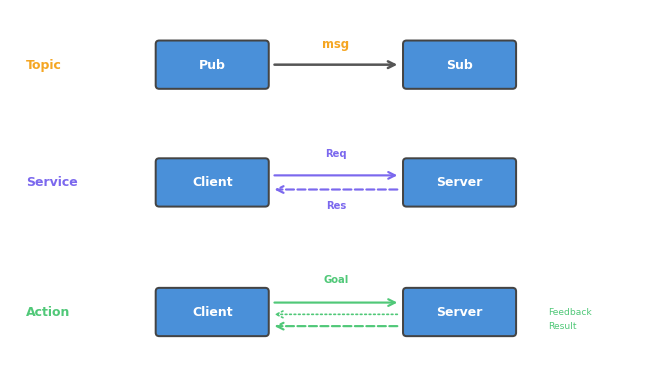

# 006. 액션 이해하기

서비스는 요청 후 응답이 올 때까지 기다려야 한다. 그런데 로봇이 목표 지점까지 이동하는 데
30초가 걸린다면? 30초 동안 아무것도 못 하고 기다리는 것은 비효율적이다.
**액션(Action)**은 이 문제를 해결한다.

## 서비스 vs 액션

| 구분 | 서비스 (Service) | 액션 (Action) |
|------|-----------------|--------------|
| 응답 | 최종 결과 1회 | 중간 피드백 + 최종 결과 |
| 대기 | 완료까지 블로킹 | 비동기 (다른 작업 가능) |
| 취소 | 불가 | 가능 |
| 용도 | 짧은 작업 | 긴 작업 (이동, 회전 등) |



액션은 내부적으로 **3개의 서비스 + 2개의 토픽**으로 구성되어 있다.
하지만 사용자 입장에서는 하나의 인터페이스로 다룬다.

## 액션의 구조

액션은 세 부분으로 나뉜다:

1. **Goal** — 클라이언트가 보내는 목표 (예: "90도 회전해줘")
2. **Feedback** — 서버가 보내는 중간 진행 상황 (예: "현재 45도 회전함")
3. **Result** — 완료 후 최종 결과 (예: "회전 완료, 최종 각도 90도")

실제 로봇에서는 "네비게이션 목표 전송 → 이동 중 위치 피드백 → 도착 완료"
패턴으로 가장 많이 사용된다.

## 사전 조건

- turtlesim 노드와 teleop 노드가 실행 중

## 1. 액션 체험하기

teleop 노드에서 키보드를 사용해보자. 다음 키들은 **액션**을 사용한다:

| 키 | 동작 |
|----|------|
| G | 절대 회전 (목표 각도로 회전) |
| D | 절대 회전 (목표 각도로 회전) |
| F | 절대 회전 (목표 각도로 회전) |
| E | 절대 회전 (목표 각도로 회전) |

teleop 터미널에 포커스를 두고 `F` 키를 누르면, 거북이가 목표 각도까지 회전한다.
회전하는 동안 teleop 터미널에 피드백 메시지가 출력되는 것을 확인하자.

회전 중에 다른 키를 누르면 **Goal이 취소**되고 새로운 회전이 시작된다.
이것이 서비스와의 핵심 차이 — 진행 중인 작업을 취소할 수 있다.

## 2. 액션 목록 확인

```bash
ros2 action list
```

```
/turtle1/rotate_absolute
```

turtlesim은 `rotate_absolute`라는 액션을 하나 제공한다.

타입까지 함께 보려면:

```bash
ros2 action list -t
```

```
/turtle1/rotate_absolute [turtlesim/action/RotateAbsolute]
```

## 3. 액션 인터페이스 확인

```bash
ros2 interface show turtlesim/action/RotateAbsolute
```

```
# Goal
float32 theta
---
# Result
float32 delta
---
# Feedback
float32 remaining
```

`---`로 구분된 세 영역:
- **Goal**: 목표 각도 (`theta`)
- **Result**: 실제로 회전한 각도 (`delta`)
- **Feedback**: 남은 각도 (`remaining`)

서비스는 Request/Response 2개였지만, 액션은 Goal/Result/Feedback 3개다.

## 4. 액션 정보 확인

```bash
ros2 action info /turtle1/rotate_absolute
```

```
Action: /turtle1/rotate_absolute
Action Clients: 1
    /teleop_turtle
Action Servers: 1
    /turtlesim
```

teleop이 액션 Client, turtlesim이 액션 Server임을 알 수 있다.

## 5. 액션 직접 호출하기

CLI에서 직접 액션을 보내보자:

```bash
ros2 action send_goal /turtle1/rotate_absolute \
  turtlesim/action/RotateAbsolute "{theta: 1.57}"
```

```
Waiting for an action server...
Sending goal:
  theta: 1.57

Goal accepted with ID: ...
Result:
  delta: -1.5679...
Goal finished with status: SUCCEEDED
```

거북이가 약 90도(1.57 라디안) 방향으로 회전한다.

### 피드백을 함께 보기

`--feedback` 옵션을 추가하면 중간 진행 상황도 볼 수 있다:

```bash
ros2 action send_goal /turtle1/rotate_absolute \
  turtlesim/action/RotateAbsolute "{theta: 3.14}" --feedback
```

```
Sending goal:
  theta: 3.14

Feedback:
  remaining: 1.57...
Feedback:
  remaining: 1.40...
Feedback:
  remaining: 1.22...
...
Result:
  delta: 1.57...
Goal finished with status: SUCCEEDED
```

`remaining` 값이 점점 줄어드는 것이 보인다.
실제 로봇에서는 이 피드백으로 이동 진행률을 UI에 표시하거나, 경로 이탈을 감지한다.

## 6. 세 가지 통신 방식 정리

ROS 2의 세 가지 통신 방식을 정리하면:

| 방식 | 용도 | 예시 |
|------|------|------|
| **토픽** | 지속적 데이터 스트리밍 | 센서 데이터, 속도 명령 |
| **서비스** | 짧은 요청-응답 | 설정 변경, 좌표 변환 |
| **액션** | 긴 작업 + 피드백 | 네비게이션, 로봇 팔 이동 |

어떤 통신 방식을 선택할지는 **작업의 성격**에 따라 결정한다:
- 짧고 즉각적 → 서비스
- 길고 피드백 필요 → 액션
- 지속적 데이터 흐름 → 토픽

## 정리

| 명령어 | 역할 |
|--------|------|
| `ros2 action list -t` | 액션 목록 + 타입 |
| `ros2 action info <액션>` | 액션의 클라이언트/서버 정보 |
| `ros2 interface show <타입>` | 액션 인터페이스 (Goal/Result/Feedback) |
| `ros2 action send_goal <액션> <타입> <값>` | 액션 목표 전송 |
| `ros2 action send_goal ... --feedback` | 피드백 포함 목표 전송 |

**이 튜토리얼에서 배운 것:**

- 액션은 Goal → Feedback → Result 구조의 비동기 통신이다
- 진행 중인 작업을 취소할 수 있다는 점이 서비스와의 핵심 차이다
- 토픽/서비스/액션은 각각 다른 용도에 적합하며, 상황에 맞게 선택한다

다음 튜토리얼에서는 노드의 동작을 실시간으로 변경할 수 있는 **파라미터**를 배운다.
