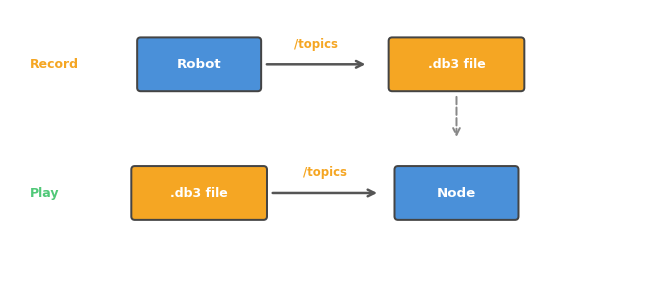

# 009. Bag 녹화와 재생

로봇을 테스트할 때 매번 실제로 로봇을 움직일 수는 없다.
**Bag**을 사용하면 토픽 데이터를 파일로 녹화하고, 나중에 재생할 수 있다.

## Bag이란?

Bag은 **토픽 메시지를 타임스탬프와 함께 저장하는 파일**이다.



Bag의 핵심 가치:

- **재현성**: 같은 데이터로 알고리즘을 반복 테스트할 수 있다
- **디버깅**: 문제가 발생한 시점의 데이터를 저장해두고 나중에 분석할 수 있다
- **개발 편의**: 로봇 없이도 녹화된 센서 데이터로 인식 알고리즘을 개발할 수 있다
- **공유**: 팀원에게 데이터를 전달하여 동일한 환경에서 작업할 수 있다

실제 로봇 개발에서 Bag은 가장 많이 사용되는 도구 중 하나다.
카메라, 라이다, IMU 데이터를 녹화해서 사무실에서 알고리즘을 개발하는 것이 일반적인 워크플로우다.

## 사전 조건

- turtlesim 노드와 teleop 노드가 실행 중

## 1. 토픽 녹화하기

### 1-1. 단일 토픽 녹화

```bash
ros2 bag record /turtle1/cmd_vel
```

녹화가 시작된다. 이 상태에서 teleop으로 거북이를 움직여보자.

```
[INFO] [rosbag2_recorder]: Opened database 'rosbag2_2025_...'.
[INFO] [rosbag2_recorder]: Listening for topics...
[INFO] [rosbag2_recorder]: Subscribed to topic '/turtle1/cmd_vel'
```

10~15초 정도 거북이를 움직인 후 `Ctrl+C`로 녹화를 종료한다.

현재 디렉토리에 `rosbag2_2025_...` 형태의 디렉토리가 생성된다.

### 1-2. 여러 토픽 동시 녹화

```bash
ros2 bag record /turtle1/cmd_vel /turtle1/pose
```

토픽 이름을 공백으로 구분하면 여러 토픽을 동시에 녹화한다.

### 1-3. 모든 토픽 녹화

```bash
ros2 bag record -a
```

`-a` 옵션은 현재 활성화된 **모든 토픽**을 녹화한다.
편리하지만 데이터량이 많아질 수 있으므로 카메라 토픽이 있을 때는 주의한다.

### 1-4. 파일 이름 지정

```bash
ros2 bag record -o my_test /turtle1/cmd_vel /turtle1/pose
```

`-o` 옵션으로 출력 디렉토리 이름을 지정한다. 기본 이름보다 알아보기 쉽다.

## 2. 녹화 파일 정보 확인

```bash
ros2 bag info my_test
```

```
Files:             my_test_0.db3
Bag size:          ... KB
Storage id:        sqlite3
Duration:          ...s
Start:             ...
End:               ...
Messages:          ...
Topic information:
    Topic: /turtle1/cmd_vel | Type: geometry_msgs/msg/Twist | Count: ...
    Topic: /turtle1/pose | Type: turtlesim/msg/Pose | Count: ...
```

녹화 기간, 메시지 수, 포함된 토픽과 각 토픽의 메시지 수를 확인할 수 있다.

## 3. 녹화 데이터 재생하기

먼저 기존 turtlesim을 초기화하자:

```bash
ros2 service call /reset std_srvs/srv/Empty
```

거북이가 중앙으로 돌아간다. 이제 재생:

```bash
ros2 bag play my_test
```

**teleop 없이** 거북이가 녹화할 때와 동일하게 움직인다.
녹화된 `/turtle1/cmd_vel` 메시지가 시간 순서대로 재생되기 때문이다.

turtlesim 입장에서는 메시지가 teleop에서 오는 것인지, bag에서 재생되는 것인지 구분하지 않는다.
이것이 ROS 2 토픽 기반 아키텍처의 장점이다 — 데이터의 출처에 상관없이 동일하게 동작한다.

## 4. 재생 옵션

### 속도 조절

```bash
ros2 bag play my_test --rate 2.0
```

2배속으로 재생한다. `0.5`로 하면 절반 속도.
느린 동작을 분석하거나, 빠르게 결과를 확인할 때 유용하다.

### 반복 재생

```bash
ros2 bag play my_test --loop
```

데이터를 반복해서 재생한다. 알고리즘 테스트 시 동일한 데이터를 반복 입력할 때 사용한다.

### 특정 토픽만 재생

```bash
ros2 bag play my_test --topics /turtle1/cmd_vel
```

여러 토픽이 녹화되어 있어도 특정 토픽만 선택적으로 재생할 수 있다.

## 5. Bag 활용 패턴

실제 로봇 개발에서 Bag을 사용하는 일반적인 패턴:

**패턴 1: 센서 데이터 수집 후 사무실에서 개발**
1. 로봇으로 주행하면서 카메라, 라이다 데이터를 녹화
2. 사무실에서 bag을 재생하면서 인식 알고리즘 개발
3. 같은 데이터로 반복 테스트하며 알고리즘 성능 비교

**패턴 2: 버그 재현**
1. 로봇에서 문제가 발생하면 그 시점의 데이터를 녹화
2. 개발 환경에서 재생하여 문제를 재현하고 디버깅

**패턴 3: 리그레션 테스트**
1. 테스트용 bag 파일 세트를 관리
2. 코드를 변경할 때마다 같은 bag으로 테스트하여 성능 저하를 방지

## 정리

| 명령어 | 역할 |
|--------|------|
| `ros2 bag record <토픽들>` | 토픽 녹화 |
| `ros2 bag record -a` | 모든 토픽 녹화 |
| `ros2 bag record -o <이름> <토픽들>` | 이름 지정하여 녹화 |
| `ros2 bag info <경로>` | 녹화 파일 정보 확인 |
| `ros2 bag play <경로>` | 녹화 데이터 재생 |
| `ros2 bag play <경로> --rate <배속>` | 배속 조절 재생 |
| `ros2 bag play <경로> --loop` | 반복 재생 |

**이 튜토리얼에서 배운 것:**

- Bag은 토픽 메시지를 파일로 녹화하고 재생하는 도구다
- 녹화된 데이터를 재생하면 로봇 없이도 동일한 테스트를 반복할 수 있다
- 센서 데이터 수집, 버그 재현, 리그레션 테스트가 주요 활용 패턴이다

**1부 완료!** 다음부터는 Python으로 직접 ROS 2 노드를 프로그래밍하는 **2부**가 시작된다.
