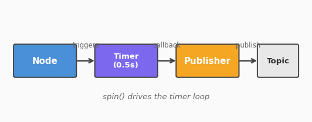

# 011. 토픽 Publisher 작성

1부에서 토픽이 **발행-구독(Pub/Sub)** 모델이라는 것을 배웠다.
이제 직접 **Publisher 노드**를 Python으로 작성하고, turtlesim과 연동해본다.

## Publisher의 구조

Publisher 노드는 다음 흐름으로 동작한다:

1. 노드 생성 → 2. Publisher 객체 생성 → 3. 타이머로 주기적 발행 → 4. spin으로 대기



핵심은 **타이머(Timer)**다. ROS 2에서 주기적으로 메시지를 보내려면 타이머 콜백을 등록하고, `spin()`이 타이머가 울릴 때마다 콜백을 실행한다.

## 사전 조건

- [010. 패키지 만들기](010_create_package.md)에서 만든 `my_first_pkg` 패키지
- 워크스페이스: `/workspaces/ros2_go2/ros2_ws`

## 1. Publisher 노드 작성

`my_first_pkg` 패키지에 새 파일을 만든다.

```python
# /workspaces/ros2_go2/ros2_ws/src/my_first_pkg/my_first_pkg/simple_publisher.py
import rclpy
from rclpy.node import Node
from std_msgs.msg import String


class SimplePublisher(Node):
    def __init__(self):
        super().__init__('simple_publisher')
        self.publisher_ = self.create_publisher(String, 'chatter', 10)
        self.timer = self.create_timer(0.5, self.timer_callback)
        self.count = 0

    def timer_callback(self):
        msg = String()
        msg.data = f'Hello ROS 2: {self.count}'
        self.publisher_.publish(msg)
        self.get_logger().info(f'Publishing: "{msg.data}"')
        self.count += 1


def main(args=None):
    rclpy.init(args=args)
    node = SimplePublisher()
    rclpy.spin(node)
    node.destroy_node()
    rclpy.shutdown()


if __name__ == '__main__':
    main()
```

### 코드 해설

| 코드 | 설명 |
|------|------|
| `from std_msgs.msg import String` | 표준 문자열 메시지 타입 import |
| `create_publisher(String, 'chatter', 10)` | `chatter` 토픽에 `String` 타입, 큐 크기 10 |
| `create_timer(0.5, self.timer_callback)` | 0.5초마다 콜백 실행 (2 Hz) |
| `self.publisher_.publish(msg)` | 메시지 발행 |

`create_publisher`의 세 번째 인자 `10`은 **QoS depth**다. 구독자가 처리하지 못한 메시지를 최대 10개까지 버퍼에 보관한다.

## 2. entry_points 등록

`setup.py`의 `console_scripts`에 추가한다.

```python
entry_points={
    'console_scripts': [
        'hello = my_first_pkg.hello_node:main',
        'simple_pub = my_first_pkg.simple_publisher:main',
    ],
},
```

## 3. 빌드와 실행

```bash
cd /workspaces/ros2_go2/ros2_ws
colcon build --packages-select my_first_pkg --symlink-install
source install/setup.bash
```

```bash
ros2 run my_first_pkg simple_pub
```

```
[INFO] [simple_publisher]: Publishing: "Hello ROS 2: 0"
[INFO] [simple_publisher]: Publishing: "Hello ROS 2: 1"
[INFO] [simple_publisher]: Publishing: "Hello ROS 2: 2"
```

다른 터미널에서 확인:

```bash
ros2 topic echo /chatter
```

```
data: 'Hello ROS 2: 5'
---
data: 'Hello ROS 2: 6'
```

## 4. Turtlesim 제어 Publisher

이번에는 실제로 터틀을 움직이는 Publisher를 만들어보자.

```python
# /workspaces/ros2_go2/ros2_ws/src/my_first_pkg/my_first_pkg/turtle_circle.py
import rclpy
from rclpy.node import Node
from geometry_msgs.msg import Twist


class TurtleCircle(Node):
    def __init__(self):
        super().__init__('turtle_circle')
        self.publisher_ = self.create_publisher(
            Twist, '/turtle1/cmd_vel', 10
        )
        self.timer = self.create_timer(0.1, self.timer_callback)

    def timer_callback(self):
        msg = Twist()
        msg.linear.x = 1.0   # 전진 속도
        msg.angular.z = 0.5   # 회전 속도
        self.publisher_.publish(msg)


def main(args=None):
    rclpy.init(args=args)
    node = TurtleCircle()
    rclpy.spin(node)
    node.destroy_node()
    rclpy.shutdown()


if __name__ == '__main__':
    main()
```

`geometry_msgs.msg.Twist`는 로봇 속도 명령의 표준 메시지다:

| 필드 | 의미 |
|------|------|
| `linear.x` | 전진/후진 속도 (m/s) |
| `linear.y` | 좌우 이동 (보통 0) |
| `angular.z` | 회전 속도 (rad/s) |

`setup.py`에 추가:

```python
'turtle_circle = my_first_pkg.turtle_circle:main',
```

### 실행

터미널 1:
```bash
ros2 run turtlesim turtlesim_node
```

터미널 2:
```bash
cd /workspaces/ros2_go2/ros2_ws && colcon build --packages-select my_first_pkg --symlink-install
source install/setup.bash
ros2 run my_first_pkg turtle_circle
```

터틀이 원을 그리며 이동하는 것을 확인할 수 있다.

## 5. 발행 주기의 의미

타이머 주기는 로봇 제어에서 중요한 의미를 갖는다:

| 주기 | Hz | 용도 |
|------|----|------|
| 1.0초 | 1 Hz | 상태 모니터링, 로그 |
| 0.1초 | 10 Hz | 일반 로봇 제어 |
| 0.02초 | 50 Hz | 정밀 모터 제어 |
| 0.01초 | 100 Hz | 드론, 고속 제어 |

주기가 짧을수록 제어가 부드럽지만 CPU 부하가 높아진다.

## 정리

| 개념 | 설명 |
|------|------|
| `create_publisher(타입, 토픽, 큐크기)` | Publisher 생성 |
| `create_timer(주기, 콜백)` | 주기적 실행 등록 |
| `publisher.publish(msg)` | 메시지 발행 |
| `rclpy.spin(node)` | 콜백 대기 루프 |

## 핵심 포인트

- Publisher는 `create_publisher` + `create_timer` 조합으로 만든다
- 타이머 콜백에서 메시지를 생성하고 `publish()`로 보낸다
- `Twist` 메시지로 로봇의 속도를 제어할 수 있다
- `--symlink-install`로 빌드하면 Python 코드 수정 시 재빌드 불필요

> **다음 튜토리얼**: [012. 토픽 Subscriber 작성](012_topic_subscriber.md)에서 발행된 메시지를 받아 처리하는 Subscriber를 만든다.
