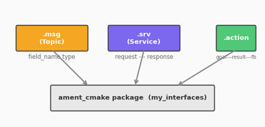

# 015. 커스텀 인터페이스 정의

지금까지 `std_msgs/String`, `geometry_msgs/Twist` 같은 기존 메시지 타입을 사용했다.
하지만 실제 로봇 개발에서는 **프로젝트에 맞는 메시지 타입**을 직접 정의해야 할 때가 많다.

이번에는 커스텀 **msg**, **srv**, **action** 인터페이스를 만드는 법을 배운다.



## 인터페이스 패키지가 필요한 이유

커스텀 인터페이스 정의에는 **CMake 빌드**가 필요하다. Python 패키지(`ament_python`)에서는 인터페이스를 직접 정의할 수 없다. 따라서 보통 **인터페이스 전용 패키지**를 별도로 만든다.

| 패키지 | 빌드 타입 | 역할 |
|--------|-----------|------|
| `my_interfaces` | `ament_cmake` | msg/srv/action 정의 |
| `my_first_pkg` | `ament_python` | 노드 코드 (인터페이스를 import해서 사용) |

## 사전 조건

- 워크스페이스: `~/ros2_ws`

## 1. 인터페이스 패키지 생성

```bash
cd ~/ros2_ws/src
ros2 pkg create --build-type ament_cmake my_interfaces
```

인터페이스 정의 파일을 넣을 디렉토리를 만든다.

```bash
mkdir -p my_interfaces/msg
mkdir -p my_interfaces/srv
mkdir -p my_interfaces/action
```

## 2. 커스텀 메시지 (msg) 정의

로봇 상태를 담는 메시지를 만든다.

```bash
cat << 'EOF' > my_interfaces/msg/RobotStatus.msg
string name
float64 battery_level
float64[3] position
bool is_moving
EOF
```

필드 타입 규칙:

| 타입 | 예시 | 설명 |
|------|------|------|
| 기본형 | `bool`, `int32`, `float64`, `string` | 단일 값 |
| 배열 | `float64[3]` | 고정 크기 배열 |
| 동적 배열 | `float64[]` | 가변 크기 배열 |
| 기본값 | `int32 count 0` | 기본값 지정 가능 |
| 다른 msg | `geometry_msgs/Point position` | 기존 메시지 타입 참조 |

## 3. 커스텀 서비스 (srv) 정의

두 문자열을 합치는 서비스를 만든다.

```bash
cat << 'EOF' > my_interfaces/srv/ConcatStrings.srv
string a
string b
---
string result
EOF
```

`---`가 Request와 Response를 구분한다. 위가 Request, 아래가 Response다.

## 4. 커스텀 액션 (action) 정의

목표 거리까지 이동하면서 진행률을 보고하는 액션을 만든다.

```bash
cat << 'EOF' > my_interfaces/action/Navigate.action
# Goal
float64 target_distance
---
# Result
float64 actual_distance
bool success
---
# Feedback
float64 current_distance
float64 progress_percent
EOF
```

액션은 `---`로 세 영역을 구분한다: Goal / Result / Feedback.

## 5. CMakeLists.txt 수정

인터페이스 파일을 빌드하려면 `CMakeLists.txt`에 등록해야 한다.

```bash
cat << 'EOF' > my_interfaces/CMakeLists.txt
cmake_minimum_required(VERSION 3.8)
project(my_interfaces)

find_package(ament_cmake REQUIRED)
find_package(rosidl_default_generators REQUIRED)
find_package(action_msgs REQUIRED)

rosidl_generate_interfaces(${PROJECT_NAME}
  "msg/RobotStatus.msg"
  "srv/ConcatStrings.srv"
  "action/Navigate.action"
)

ament_export_dependencies(rosidl_default_runtime)
ament_package()
EOF
```

핵심은 `rosidl_generate_interfaces` — 이 매크로가 `.msg`, `.srv`, `.action` 파일을 Python/C++ 코드로 변환한다.

## 6. package.xml 수정

```bash
cat << 'EOF' > my_interfaces/package.xml
<?xml version="1.0"?>
<package format="3">
  <name>my_interfaces</name>
  <version>0.0.1</version>
  <description>Custom ROS 2 interfaces</description>
  <maintainer email="user@example.com">user</maintainer>
  <license>Apache-2.0</license>

  <buildtool_depend>ament_cmake</buildtool_depend>
  <buildtool_depend>rosidl_default_generators</buildtool_depend>

  <depend>action_msgs</depend>
  <exec_depend>rosidl_default_runtime</exec_depend>

  <member_of_group>rosidl_interface_packages</member_of_group>

  <export>
    <build_type>ament_cmake</build_type>
  </export>
</package>
EOF
```

의존성 정리:

| 태그 | 패키지 | 역할 |
|------|--------|------|
| `buildtool_depend` | `rosidl_default_generators` | msg/srv/action → 코드 변환 도구 |
| `exec_depend` | `rosidl_default_runtime` | 런타임 시 메시지 직렬화 라이브러리 |
| `member_of_group` | `rosidl_interface_packages` | 인터페이스 패키지임을 선언 |

## 7. 빌드

```bash
cd ~/ros2_ws
colcon build --packages-select my_interfaces
source install/setup.bash
```

## 8. 확인

빌드 성공 후 인터페이스를 확인한다.

```bash
ros2 interface show my_interfaces/msg/RobotStatus
```

```
string name
float64 battery_level
float64[3] position
bool is_moving
```

```bash
ros2 interface show my_interfaces/srv/ConcatStrings
```

```
string a
string b
---
string result
```

```bash
ros2 interface show my_interfaces/action/Navigate
```

```
float64 target_distance
---
float64 actual_distance
bool success
---
float64 current_distance
float64 progress_percent
```

## 9. Python에서 사용하기

커스텀 인터페이스를 사용하는 노드를 만들어보자.

먼저 `my_first_pkg`의 `package.xml`에 의존성을 추가한다:

```xml
<depend>my_interfaces</depend>
```

그리고 노드 코드에서 import한다:

```python
from my_interfaces.msg import RobotStatus
from my_interfaces.srv import ConcatStrings
from my_interfaces.action import Navigate
```

예시 — RobotStatus Publisher:

```bash
cat << 'PYEOF' > ~/ros2_ws/src/my_first_pkg/my_first_pkg/status_publisher.py
import rclpy
from rclpy.node import Node
from my_interfaces.msg import RobotStatus


class StatusPublisher(Node):
    def __init__(self):
        super().__init__('status_publisher')
        self.publisher_ = self.create_publisher(
            RobotStatus, 'robot_status', 10
        )
        self.timer = self.create_timer(1.0, self.timer_callback)
        self.battery = 100.0

    def timer_callback(self):
        msg = RobotStatus()
        msg.name = 'go2'
        msg.battery_level = self.battery
        msg.position = [1.0, 2.0, 0.0]
        msg.is_moving = True
        self.publisher_.publish(msg)
        self.get_logger().info(
            f'Status: {msg.name}, battery={msg.battery_level:.1f}%'
        )
        self.battery -= 0.5


def main(args=None):
    rclpy.init(args=args)
    node = StatusPublisher()
    rclpy.spin(node)
    node.destroy_node()
    rclpy.shutdown()


if __name__ == '__main__':
    main()
PYEOF
```

`setup.py`에 entry_point를 추가하고 빌드하면 `ros2 topic echo /robot_status`로 확인할 수 있다.

## 10. 인터페이스 설계 팁

| 원칙 | 설명 |
|------|------|
| 기존 타입 우선 | `geometry_msgs`, `sensor_msgs` 등에 맞는 타입이 있으면 재사용 |
| 작게 유지 | 하나의 msg에 너무 많은 필드를 넣지 않는다 |
| 네이밍 컨벤션 | PascalCase로 정의 (`RobotStatus`, `Navigate`) |
| 인터페이스 패키지 분리 | 인터페이스만 모은 별도 패키지를 만든다 |

## 정리

| 파일 | 용도 | 구분자 |
|------|------|--------|
| `.msg` | 토픽 메시지 타입 | 없음 |
| `.srv` | 서비스 타입 | `---` (Request / Response) |
| `.action` | 액션 타입 | `---` 2개 (Goal / Result / Feedback) |

## 핵심 포인트

- 커스텀 인터페이스는 `ament_cmake` 패키지에서 정의한다
- `.msg`, `.srv`, `.action` 파일을 작성하고 `CMakeLists.txt`에 등록한다
- `rosidl_generate_interfaces`가 Python/C++ 바인딩을 자동 생성한다
- Python 노드에서 `from my_interfaces.msg import ...`으로 사용한다
- 기존 표준 타입이 있으면 재사용하고, 없을 때만 커스텀을 만든다

> **다음 튜토리얼**: [016. 파라미터 프로그래밍](016_parameter_programming.md)에서 노드 파라미터를 코드로 선언하고 동적으로 변경하는 법을 배운다.
