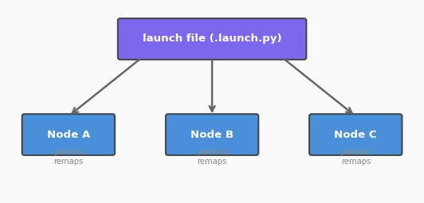

# 017. Launch 파일 작성

지금까지 노드를 실행할 때 터미널을 여러 개 열고 `ros2 run`을 반복했다.
**Launch 파일**을 사용하면 여러 노드를 **한 번에** 실행하고, 파라미터와 리매핑까지 설정할 수 있다.



## Launch 파일이 필요한 이유

실제 로봇 시스템은 수십 개의 노드로 구성된다. 센서 드라이버, 상태 추정, 경로 계획, 제어기 등을 매번 수동으로 실행하는 것은 비현실적이다.

Launch 파일은 **시스템 구성의 코드화**다:
- 어떤 노드를 실행할지
- 각 노드에 어떤 파라미터를 줄지
- 토픽 이름을 어떻게 리매핑할지
- 조건부 실행 (시뮬레이션 vs 실기기)

## Launch 파일 형식

ROS 2는 세 가지 형식의 Launch 파일을 지원한다:

| 형식 | 확장자 | 특징 |
|------|--------|------|
| Python | `.launch.py` | 가장 유연, 조건/반복 가능 |
| XML | `.launch.xml` | 간결, ROS 1과 유사 |
| YAML | `.launch.yaml` | 선언적, 가독성 좋음 |

이 튜토리얼에서는 **Python 형식**을 사용한다. 실무에서 가장 많이 쓰이며 프로그래밍적 제어가 가능하다.

## 사전 조건

- `my_first_pkg` 패키지의 노드들이 빌드된 상태
- 워크스페이스: `/workspaces/ros2_go2/ros2_ws`

## 1. Launch 디렉토리 생성

```bash
mkdir -p /workspaces/ros2_go2/ros2_ws/src/my_first_pkg/launch
```

## 2. 기본 Launch 파일 작성

turtlesim과 teleop을 한 번에 실행하는 Launch 파일을 만든다.

```python
# /workspaces/ros2_go2/ros2_ws/src/my_first_pkg/launch/turtlesim.launch.py
from launch import LaunchDescription
from launch_ros.actions import Node


def generate_launch_description():
    return LaunchDescription([
        Node(
            package='turtlesim',
            executable='turtlesim_node',
            name='sim',
        ),
        Node(
            package='turtlesim',
            executable='turtle_teleop_key',
            name='teleop',
            prefix='xterm -e',  # 별도 터미널에서 실행
        ),
    ])
```

### 구조 해설

| 요소 | 설명 |
|------|------|
| `generate_launch_description()` | 필수 함수, `LaunchDescription` 반환 |
| `Node(package, executable, name)` | 실행할 노드 정의 |
| `prefix='xterm -e'` | 별도 터미널 창에서 실행 (키 입력용) |

## 3. setup.py에 Launch 파일 포함

Launch 파일이 설치되려면 `setup.py`에 데이터 파일로 등록해야 한다.

`setup.py` 상단에 import를 추가하고 `data_files`를 수정한다:

```python
import os
from glob import glob
from setuptools import find_packages, setup

# ...

data_files=[
    ('share/ament_index/resource_index/packages',
        ['resource/my_first_pkg']),
    ('share/my_first_pkg', ['package.xml']),
    (os.path.join('share', 'my_first_pkg', 'launch'),
        glob(os.path.join('launch', '*.launch.py'))),
],
```

빌드 후 실행:

```bash
cd /workspaces/ros2_go2/ros2_ws && colcon build --packages-select my_first_pkg --symlink-install
source install/setup.bash
ros2 launch my_first_pkg turtlesim.launch.py
```

두 노드가 동시에 실행된다.

## 4. 파라미터 설정

Launch 파일에서 노드의 파라미터를 지정할 수 있다.

```python
# /workspaces/ros2_go2/ros2_ws/src/my_first_pkg/launch/param_demo.launch.py
from launch import LaunchDescription
from launch_ros.actions import Node


def generate_launch_description():
    return LaunchDescription([
        Node(
            package='turtlesim',
            executable='turtlesim_node',
            name='sim',
            parameters=[{
                'background_r': 50,
                'background_g': 50,
                'background_b': 200,
            }],
        ),
        Node(
            package='my_first_pkg',
            executable='param_turtle',
            name='controller',
            parameters=[{
                'speed': 2.0,
                'turn_rate': 0.8,
                'enable': True,
            }],
        ),
    ])
```

파라미터를 YAML 파일로 분리할 수도 있다:

```python
parameters=['/path/to/params.yaml'],
```

## 5. 리매핑

토픽이나 서비스 이름을 바꿀 수 있다.

```python
# /workspaces/ros2_go2/ros2_ws/src/my_first_pkg/launch/remap_demo.launch.py
from launch import LaunchDescription
from launch_ros.actions import Node


def generate_launch_description():
    return LaunchDescription([
        Node(
            package='turtlesim',
            executable='turtlesim_node',
            name='sim',
        ),
        Node(
            package='my_first_pkg',
            executable='simple_pub',
            name='my_publisher',
            remappings=[
                ('chatter', '/turtle1/cmd_vel'),
            ],
        ),
    ])
```

`remappings`는 `(원래이름, 새이름)` 튜플의 리스트다. 이를 통해 코드 수정 없이 노드 간 연결을 변경할 수 있다.

## 6. Launch Arguments

실행 시 인자를 받아 동적으로 설정을 변경할 수 있다.

```python
# /workspaces/ros2_go2/ros2_ws/src/my_first_pkg/launch/configurable.launch.py
from launch import LaunchDescription
from launch.actions import DeclareLaunchArgument
from launch.substitutions import LaunchConfiguration
from launch_ros.actions import Node


def generate_launch_description():
    speed_arg = DeclareLaunchArgument(
        'speed', default_value='1.0',
        description='Turtle speed'
    )

    bg_color_arg = DeclareLaunchArgument(
        'bg_blue', default_value='255',
        description='Background blue value'
    )

    return LaunchDescription([
        speed_arg,
        bg_color_arg,
        Node(
            package='turtlesim',
            executable='turtlesim_node',
            name='sim',
            parameters=[{
                'background_r': 0,
                'background_g': 0,
                'background_b': LaunchConfiguration('bg_blue'),
            }],
        ),
        Node(
            package='my_first_pkg',
            executable='param_turtle',
            name='controller',
            parameters=[{
                'speed': LaunchConfiguration('speed'),
                'turn_rate': 0.5,
            }],
        ),
    ])
```

실행 시 인자를 전달한다:

```bash
ros2 launch my_first_pkg configurable.launch.py speed:=3.0 bg_blue:=100
```

### Launch Arguments 핵심

| 요소 | 설명 |
|------|------|
| `DeclareLaunchArgument` | 인자 선언 (이름, 기본값, 설명) |
| `LaunchConfiguration('name')` | 인자 값 참조 (지연 평가) |

`LaunchConfiguration`은 **지연 평가(lazy evaluation)**된다. Launch 파일이 실행될 때 실제 값이 결정되므로, 선언 시점에는 문자열 참조만 저장된다.

## 7. 조건부 실행

시뮬레이션과 실기기를 구분하는 패턴:

```python
from launch.actions import DeclareLaunchArgument
from launch.conditions import IfCondition
from launch.substitutions import LaunchConfiguration

use_sim_arg = DeclareLaunchArgument('use_sim', default_value='true')

Node(
    package='turtlesim',
    executable='turtlesim_node',
    condition=IfCondition(LaunchConfiguration('use_sim')),
)
```

이 패턴은 3부의 Go2 시뮬레이션에서 실제로 사용하게 된다.

## 8. 다른 Launch 파일 포함하기

큰 시스템은 여러 Launch 파일로 나누고 조합한다.

```python
from launch.actions import IncludeLaunchDescription
from launch.launch_description_sources import PythonLaunchDescriptionSource
import os
from ament_index_python.packages import get_package_share_directory

IncludeLaunchDescription(
    PythonLaunchDescriptionSource(
        os.path.join(
            get_package_share_directory('my_first_pkg'),
            'launch',
            'turtlesim.launch.py'
        )
    ),
    launch_arguments={'speed': '2.0'}.items(),
)
```

## 정리

| 기능 | 코드 |
|------|------|
| 노드 실행 | `Node(package, executable, name)` |
| 파라미터 | `parameters=[{'key': value}]` |
| 리매핑 | `remappings=[('from', 'to')]` |
| 인자 선언 | `DeclareLaunchArgument('name', default)` |
| 인자 참조 | `LaunchConfiguration('name')` |
| 조건부 | `condition=IfCondition(...)` |
| 포함 | `IncludeLaunchDescription(...)` |

## 핵심 포인트

- Launch 파일은 **시스템 구성을 코드로 관리**하는 방법이다
- Python Launch 파일이 가장 유연하고 실무에서 많이 쓰인다
- `parameters`, `remappings`, `LaunchConfiguration`으로 유연한 설정이 가능하다
- `IfCondition`으로 시뮬레이션/실기기 전환을 구현할 수 있다
- `setup.py`의 `data_files`에 Launch 파일을 등록해야 `ros2 launch`로 실행된다

> **다음 튜토리얼**: [018. Go2 개발 환경 구축](018_go2_dev_setup.md)에서 Unitree Go2 시뮬레이터를 설치하고 ROS 2와 연동한다.
